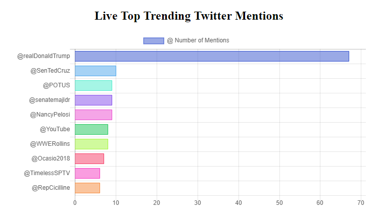
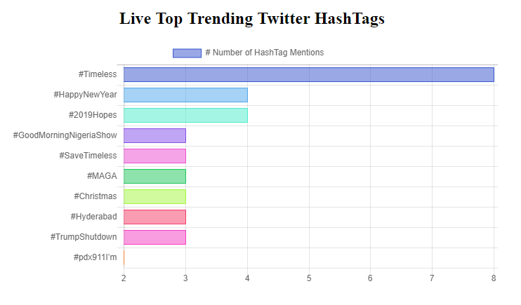

# Live Tweet Analysis via continous streaming using Spark

The Application has features to extract the continous tweets based on location and analyze the Top trends the of Popular HashTags, Popular Mentions at frequency of every 10 seconds.

  

  

## How It Works
1. We first create a Client-Server connection on a port locally, and we extract live stream of data from `twitter-stream-api`.
2. Spark Application is continously listening to this port for new data.
3. The streaming data is analyzed using spark RDD, Dataframes and used various spark operations like Map, Reduce, updateStateByKey for analysis on the tweets every 10 seconds.
4. Dashboards showing trends are refreshed automatically to reflect the changing trends.

## Apache Spark Resources
https://jaceklaskowski.gitbooks.io/mastering-apache-spark/  
Official Documentation Apache Spark : https://spark.apache.org/docs/latest/index.html
